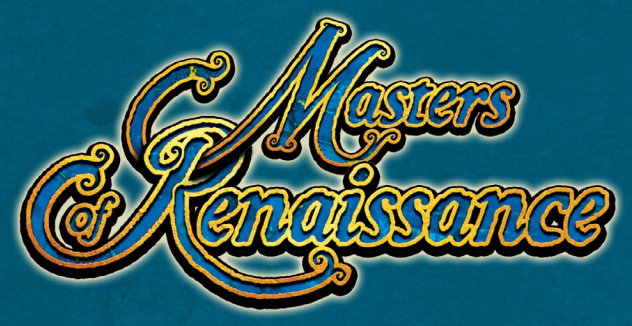

# Prova Finale di Ingegneria del Software - AA 2020-2021



Il progetto consiste nell’implementazione di un sistema distribuito composto da un singolo server in grado di gestire una partita alla volta e multipli client (uno per giocatore) che possono partecipare ad una sola partita alla volta utilizzando il pattern MVC (Model-View-Controller).
La rete è stata gestita con l'utilizzo delle socket.

Interazione e gameplay: linea di comando (CLI) e grafica (GUI).

## Documentazione

### UML
I diagrammi UML delle classi si trovano nella cartella deliveries del progetto, rappresentano rispettivamente il modello iniziale sviluppato durante la fase di progettazione e i diagrammi del prodotto finale.


### Librerie e Plugins
|Libreria/Plugin|Descrizione|
|---------------|-----------|
|__Maven__|Strumento di automazione della compilazione utilizzato principalmente per progetti Java.|
|__JavaFx__|Libreria grafica per realizzare interfacce utente.|
|__JUnit__|Framework di unit testing.|

## Funzionalità
### Funzionalità Sviluppate
- Regole Complete
- CLI
- GUI
- Socket
- 2 FA (Funzionalità Avanzate):
    - __Resilienza alle disconnessioni
    - __Persistenza del server
  
Il server gestisce una sola partita per volta, anche in caso di disconnessione di tutti i giocatori la partita si conserva e non viene automaticamente terminata

La persistenza del server è realizzata tramite salvataggio su file del game controller.

Il game controller viene salvato tramite selializzazione su file "game.txt" salvato nella home directory della macchina su cui gira il server.

## Compilazione e packaging
I jar sono stati realizzati con l'ausilio di Maven Shade Plugin.
Nella cartella shade è fornito il jar precompilato.


### Master of Renaissance 
Le seguenti istruzioni descrivono come eseguire il client con interfaccia CLI o GUI.

Digitare da terminale il comando:
```
java -jar AM26.jar 
```
successivamente sarà possibile scegliere se lanciare server , cli o gui.

Il progetto è stato testato su: 

shell bash(macOS Catalina 10) , shell cmd e poweshell (Windows 10).

Su OS Windows la Cli deve essere lanciata da terminale WSL2, la Gui da cmd o Powershell.


## Componenti del gruppo
- [__Alessandra Atria__](https://github.com/Aleatria)
- [__Alice Cariboni__](https://github.com/A1iceCariboni)
- [__Sofia Canestraci__](https://github.com/SofiaGretaCanestraci)
